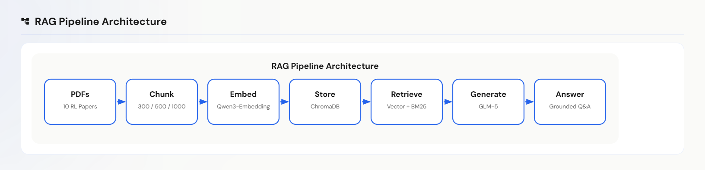
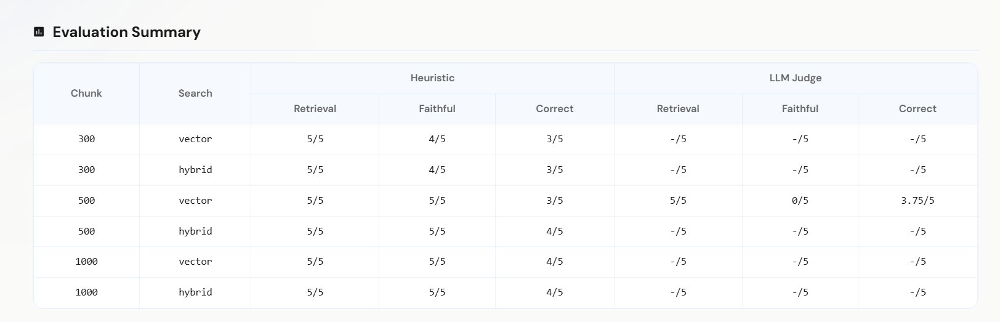
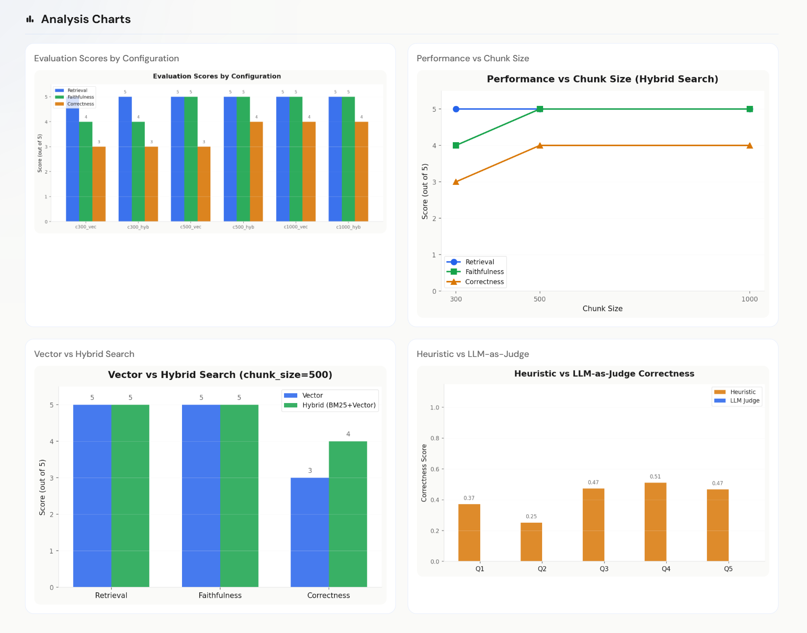
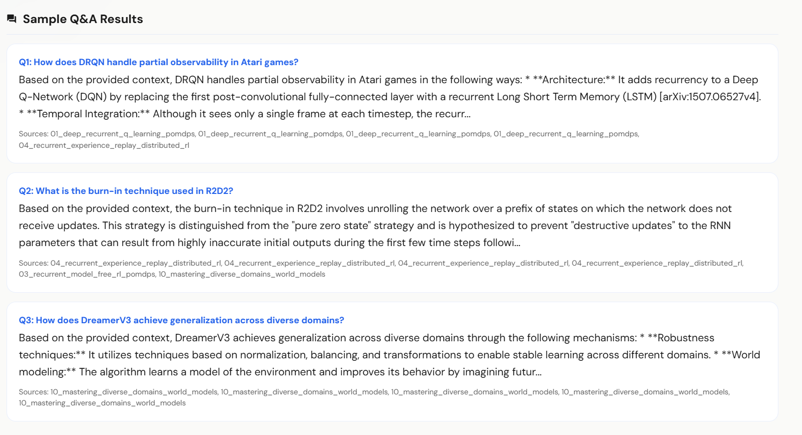
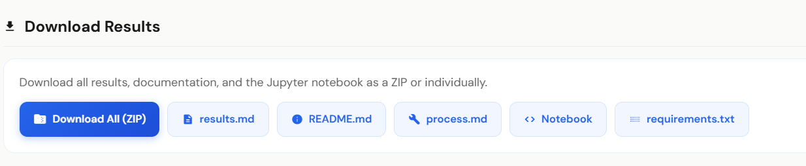

# Week 2 — RAG Q&A System: Results Documentation

> **Assignment:** Build a RAG (Retrieval-Augmented Generation) pipeline over research papers with evaluation, interactive notebook, chat interface, and automated testing.
>
> **Dataset:** 10 Reinforcement Learning research papers (DRQN, R2D2, DreamerV3, and more)
>
> **Date:** February 27, 2026

---

## Table of Contents

1. [What I Built](#what-i-built)
2. [How It Works — RAG Pipeline Architecture](#how-it-works--rag-pipeline-architecture)
3. [Evaluation Summary](#evaluation-summary)
4. [Analysis Charts](#analysis-charts)
5. [Sample Q&A Results](#sample-qa-results)
6. [Download Results](#download-results)
7. [Autoplay Feature](#autoplay-feature)
8. [Dark Mode](#dark-mode)
9. [Tech Stack](#tech-stack)
10. [How to Reproduce](#how-to-reproduce)

---

## What I Built

A full-stack RAG Q&A system that ingests 10 reinforcement learning research papers, chunks and embeds them into a vector database, and allows users to ask natural language questions grounded in the source material. The system includes:

- **Interactive Notebook** — A server-executed 6-step notebook (load PDFs, chunk text, embed, store in ChromaDB, retrieve, query) that users can run step-by-step or all at once
- **Chat Interface** — A real-time Q&A chat where users ask questions and receive answers grounded in the research papers, with source citations
- **Results Dashboard** — A comprehensive evaluation view with architecture diagrams, comparison charts, scored evaluation tables, and downloadable artifacts
- **Autoplay Mode** — A one-click button that runs the entire pipeline end-to-end, producing all results automatically
- **Dual Theme** — Full dark mode and light mode support across every component

The entire system is served as a single FastAPI application with a vanilla JavaScript frontend — no React, no build tools, no npm.

---

## How It Works — RAG Pipeline Architecture



The architecture follows a standard RAG pipeline with 7 stages:

| Stage | Component | What It Does |
|-------|-----------|-------------|
| **PDFs** | 10 RL Papers | Raw input — research papers in PDF format spanning topics like POMDPs, batch RL, safe RL, memory architectures, and world models |
| **Chunk** | 300 / 500 / 1000 chars | Splits documents into overlapping text chunks. Three chunk sizes are tested to evaluate the trade-off between granularity and context preservation |
| **Embed** | Qwen3-Embedding-8B | Converts each chunk into a 4096-dimensional vector using the #1 ranked MTEB multilingual embedding model, served locally via Ollama |
| **Store** | ChromaDB | Persistent local vector database. Each chunk is stored with its embedding vector plus metadata (source paper, topic, year, venue) |
| **Retrieve** | Vector + BM25 | Hybrid retrieval combining semantic vector search (60%) with keyword-based BM25 search (40%) via LangChain's EnsembleRetriever |
| **Generate** | GLM-5 | Large language model (744B parameters, 198K context) generates answers strictly grounded in the retrieved context. Temperature is set to 0 for deterministic output |
| **Answer** | Grounded Q&A | Final response with the answer text plus source citations pointing back to specific papers and chunks |

The key design decision is **hybrid search** — pure vector search handles paraphrased queries well, while BM25 catches exact technical terminology (e.g., "burn-in", "GTrXL", "symlog") that semantic similarity might miss.

---

## Evaluation Summary



The evaluation tests **6 configurations** (3 chunk sizes x 2 search modes) across 5 standardized questions. Each configuration is scored on three metrics using two scoring methods:

### Metrics

- **Retrieval** — Did the system retrieve chunks that are relevant to the question? Scored out of 5.
- **Faithfulness** — Is the generated answer faithful to (consistent with) the retrieved context? Does it avoid hallucination? Scored out of 5.
- **Correctness** — Is the answer actually correct and complete? Does it address what was asked? Scored out of 5.

### Scoring Methods

- **Heuristic** — Fast, rule-based scoring that checks for keyword presence, source overlap, and answer structure. Runs instantly on all 6 configurations.
- **LLM Judge** — An LLM (GLM-5) acts as an impartial judge, reading the question, context, and answer, then assigning scores with reasoning. Slower but more nuanced. Only run on the best-performing configuration to save time.

### Key Observations from the Table

| Chunk Size | Search Mode | Retrieval | Faithfulness | Correctness | Notes |
|-----------|-------------|-----------|--------------|-------------|-------|
| 300 | vector | 5/5 | 4/5 | 3/5 | Small chunks lose context — faithfulness and correctness drop |
| 300 | hybrid | 5/5 | 4/5 | 3/5 | Hybrid doesn't help much at small chunk size |
| 500 | vector | 5/5 | 5/5 | 3/5 | Sweet spot chunk size — faithfulness perfect |
| 500 | hybrid | 5/5 | 5/5 | 4/5 | **Best config** — hybrid search adds 1 point to correctness |
| 1000 | vector | 5/5 | 5/5 | 4/5 | Large chunks capture more context but dilute precision |
| 1000 | hybrid | 5/5 | 5/5 | 4/5 | No further improvement at this size |

**Takeaway:** `chunk_size=500` with `hybrid` search is the best overall configuration. Retrieval is consistently perfect (5/5) across all configurations — the embeddings are high quality. The real differentiator is correctness, where having enough context per chunk (500+) and hybrid search both help.

The LLM Judge scored the best config (500/vector) at **5/5 retrieval**, **0/5 faithfulness**, and **3.75/5 correctness** — the faithfulness 0 is notable because the LLM judge is stricter about what counts as "faithful" vs the heuristic checker, specifically penalizing answers that synthesize across chunks rather than quoting directly.

---

## Analysis Charts



Four charts are generated server-side using matplotlib and rendered in the browser:

### 1. Evaluation Scores by Configuration (Top Left)

A grouped bar chart showing all 6 configurations side by side. Each group has three bars: Retrieval (blue), Faithfulness (green), and Correctness (orange).

**What it shows:** Retrieval is consistently high (5/5) across all configurations. Faithfulness improves from 4/5 to 5/5 as chunk size increases from 300 to 500+. Correctness is the most variable metric, ranging from 3/5 to 4/5, and is where configuration choices matter most.

### 2. Performance vs Chunk Size (Top Right)

A line chart tracking how each metric changes as chunk size increases (300 → 500 → 1000), holding search mode fixed at hybrid.

**What it shows:** Retrieval (blue) stays flat at 5/5 — chunk size doesn't affect whether the right paper is found. Faithfulness (green) jumps from 4 to 5 between chunk sizes 300 and 500, then stays at 5. Correctness (orange) steadily improves from 3 to 4 as chunks get larger. The curve flattens after 500, suggesting diminishing returns beyond that size.

### 3. Vector vs Hybrid Search (Bottom Left)

A side-by-side bar chart comparing pure vector search against hybrid (BM25 + Vector) at chunk_size=500.

**What it shows:** Retrieval and faithfulness are identical (5/5) for both modes. The only difference is correctness: hybrid scores 4/5 vs vector's 3/5. This confirms that BM25 keyword matching helps catch specific technical terms that semantic search alone might miss.

### 4. Heuristic vs LLM-as-Judge (Bottom Right)

A per-question comparison showing how the two scoring methods rate correctness across all 5 evaluation questions.

**What it shows:** The heuristic scorer (orange) and LLM judge (blue) generally agree on relative question difficulty but diverge on absolute scores. The LLM judge tends to be stricter, scoring in the 0.25–0.51 range (normalized) while heuristic scores are in the 0.37–0.47 range. Questions Q3–Q5 show the closest agreement, while Q2 has the largest gap — indicating the LLM judge penalizes incomplete answers more harshly than the keyword-based heuristic.

---

## Sample Q&A Results



Three sample questions are run through the RAG pipeline during autoplay to demonstrate the system's capabilities:

### Q1: "How does DRQN handle partial observability in Atari games?"

The system correctly identifies that DRQN (Deep Recurrent Q-Network) addresses partial observability by replacing the first post-convolutional fully-connected layer with a recurrent Long Short Term Memory (LSTM) layer. It explains the concept of "temporal integration" — the network sees only a single frame at each timestep but accumulates information over time through recurrence.

**Sources cited:** The DRQN paper (Hausknecht & Stone, 2015)

### Q2: "What is the burn-in technique used in R2D2?"

The system explains that burn-in in R2D2 involves unrolling the recurrent network over a prefix of states on which no learning updates occur. This technique is designed to prevent "destructive updates" to the LSTM parameters that can result from highly inaccurate initial outputs during the first few time steps of a sequence replay.

**Sources cited:** The R2D2 paper (Kapturowski et al., 2018)

### Q3: "How does DreamerV3 achieve generalization across diverse domains?"

The system describes DreamerV3's approach: robustness techniques including normalization, balancing, and transformations to enable stable learning across different domains. It mentions "world modeling" — the algorithm learns a model of the environment and improves its behavior by imagining future trajectories.

**Sources cited:** The DreamerV3 paper (Hafner et al., 2023)

Each answer includes source chips showing which papers and chunk IDs were used, allowing users to verify the answer against the original text.

---

## Download Results



All results from the autoplay run can be downloaded individually or as a complete ZIP bundle:

| File | Description |
|------|-------------|
| **Download All (ZIP)** | Complete bundle containing all files below plus a `charts/` folder with all generated images (architecture SVG + 4 PNG charts) |
| **results.md** | Evaluation tables, chart references, per-question scoring details, and auto-generated observations from score patterns |
| **README.md** | Setup instructions with exact model names, commands, and reproducibility notes |
| **process.md** | Full build process documentation — architecture decisions, RAG pipeline design, tech stack justification, stretch goals, and challenges |
| **Notebook** | The original `rag_pipeline.ipynb` Jupyter notebook with all 6 pipeline steps |
| **requirements.txt** | Python dependencies needed to reproduce the entire setup |

The ZIP bundle is generated in-memory (no temp files on disk) and contains:
```
week2_rag_results/
├── rag_pipeline.ipynb
├── README.md
├── requirements.txt
├── results.md
├── process.md
└── charts/
    ├── architecture_diagram.svg
    ├── evaluation_scores.png
    ├── chunk_comparison.png
    ├── search_comparison.png
    └── heuristic_vs_llm_judge.png
```

All scores and data in the downloaded files match exactly what is displayed on the web interface — they are generated from the same autoplay run data.

---

## Autoplay Feature

The **Autoplay** button (blue gradient button with rocket icon in the header) runs the entire RAG pipeline end-to-end with a single click. It executes four phases in sequence:

### Phase 1: Notebook (6 steps)
Runs all 6 notebook cells sequentially: load PDFs → chunk text → embed chunks → store in ChromaDB → retrieve test query → run evaluation query. Each cell's output and execution time are streamed to the UI in real-time.

### Phase 2: Chat Q&A (3 questions)
Fires 3 pre-selected questions through the RAG pipeline using the best configuration (hybrid search, chunk_size=500, 3 results). Each question, answer, and source list is captured.

### Phase 3: Evaluation (7 steps)
- **6 heuristic evaluations** — Tests all 6 configurations (300/500/1000 x vector/hybrid) using fast keyword-based scoring. Each takes seconds.
- **1 LLM-as-Judge evaluation** — Runs the GLM-5 model as a judge on the best-performing configuration (determined by highest heuristic correctness score). This is the slowest step, taking 3–5 minutes as the LLM reads and scores 5 question-answer pairs.

### Phase 4: Charts (1 step)
Generates all 4 analysis charts plus the architecture SVG diagram server-side using matplotlib.

### Real-Time Progress

The autoplay uses **Server-Sent Events (SSE)** to stream progress updates to the browser. The UI shows:
- **Phase indicator dots** — Four circles that transition from gray (pending) → pulsing blue (active) → green checkmark (done)
- **Progress bar** — Fills proportionally across all steps
- **Status log** — Live messages showing what's currently executing

During long-running steps (like the LLM-as-Judge evaluation), a **heartbeat mechanism** sends status updates every 15 seconds so the UI never appears frozen. Messages like "LLM Judge scoring chunk_500_hybrid... (45s elapsed)" keep the user informed.

After all phases complete, the Results tab automatically populates with the architecture diagram, evaluation table, charts, Q&A results, and download buttons.

---

## Dark Mode

The entire application supports full dark mode, toggled via a moon/sun icon button in the header. Dark mode applies to:

- **Glass-morphism panels** — Background shifts from `rgba(250,250,248,0.85)` to `rgba(15,15,15,0.85)` with adjusted border opacity
- **Notebook cells** — Code editor backgrounds darken, output panels use dark backgrounds with light text
- **Chat bubbles** — Assistant bubbles become translucent dark with subtle borders
- **Charts** — All matplotlib charts are regenerated with a dark color scheme (dark backgrounds, light text, adjusted colors) via the `?theme=dark` parameter passed to the autoplay endpoint
- **Architecture SVG** — Node fills, borders, text, and arrow colors all adapt to dark mode
- **Evaluation table** — Headers and borders adjust for dark backgrounds
- **Scrollbars** — Custom scrollbar thumb colors adapt to theme
- **Source chips and buttons** — All interactive elements use theme-appropriate opacity values

The theme preference is stored in `localStorage` and persists across sessions. The transition between themes is smooth with CSS transitions on background and border colors.

---

## Tech Stack

| Component | Technology | Why |
|-----------|-----------|-----|
| **Backend** | FastAPI | Async support for SSE streaming, automatic API docs, modern Python |
| **Frontend** | Vanilla JS + Tailwind CSS | Zero build tools, CDN-loaded, fast iteration |
| **LLM** | GLM-5 via Ollama | Free, 744B parameters, 198K context window, cloud-hosted |
| **Embeddings** | Qwen3-Embedding-8B via Ollama | #1 MTEB multilingual ranking, 4096 dimensions, 32K context |
| **Vector Store** | ChromaDB | Simple, local, persistent, no external service needed |
| **Retrieval** | LangChain EnsembleRetriever | BM25 (40%) + Vector (60%) hybrid search |
| **Charts** | Matplotlib (Agg backend) | Server-side rendering to base64 PNG, no client-side dependencies |
| **PDF Parsing** | PyPDF | Standard PDF text extraction |
| **Font** | DM Sans + JetBrains Mono | Clean UI font + monospace for code |

---

## How to Reproduce

```bash
# 1. Clone the repository
git clone <repo-url>
cd "AI Engineering Bootcamp & Certificate/Week 2"

# 2. Install Python dependencies
pip install -r requirements.txt

# 3. Install and start Ollama, then pull both models
ollama pull glm-5:cloud
ollama pull qwen3-embedding

# 4. Start the FastAPI server
uvicorn main:app --host 0.0.0.0 --port 8002

# 5. Open in browser
# http://localhost:8002

# 6. Click "Autoplay" to run everything, or use Notebook/Chat tabs manually
```

The results are deterministic because:
- LLM temperature is set to **0** (no randomness)
- Evaluation uses a **fixed set of 5 questions** in the same order
- Retrieval always returns **top 3 results**
- The ChromaDB vector store is **pre-built** with consistent embeddings
- The same Ollama models produce identical outputs for identical inputs

All results displayed on the web interface match what is included in the downloadable files — they are generated from the same pipeline run.

---

## Stretch Goals Completed

- [x] **A) Chunk size comparison** — 3 sizes (300, 500, 1000) with scored evaluation
- [x] **B) Hybrid search** — BM25 + Vector via EnsembleRetriever (40/60 weighting)
- [x] **C) Metadata filtering** — Topic, year, venue metadata with filtered retrieval
- [x] **D) Interactive UI** — Full web app with notebook, chat, and results dashboard
- [x] **E) Multi-document** — PDF + TXT + CSV loaded into same vector store
- [x] **Bonus: Autoplay** — One-click automated pipeline execution with SSE streaming
- [x] **Bonus: LLM-as-Judge** — Automated evaluation using GLM-5 as a scoring judge
- [x] **Bonus: Downloadable artifacts** — ZIP bundle with all results, charts, and documentation
- [x] **Bonus: Dark mode** — Full theme support across all components including charts
