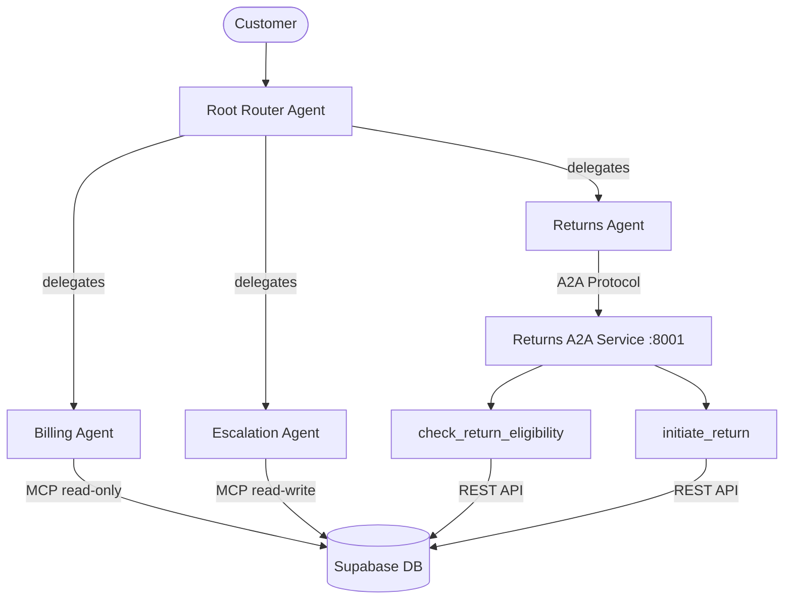

# Nexus — Multi-Agent Customer Support

A multi-agent customer support system built with Google ADK, featuring Supabase MCP integration for database access and A2A protocol for inter-agent communication.

**Live:** [theaiinternship.ayushojha.com/week3/nexus/](https://theaiinternship.ayushojha.com/week3/nexus/)

## Architecture



## Stack

| Component | Technology |
|-----------|-----------|
| Agent Framework | Google ADK (Agent Development Kit) |
| LLM | Gemini 2.5 Flash |
| Database | Self-hosted Supabase (PostgreSQL) |
| MCP Server | selfhosted-supabase-mcp |
| Protocol | A2A (Agent-to-Agent) for returns service |
| Backend | FastAPI + Uvicorn |
| Frontend | Vanilla JS + Tailwind CSS |
| Deployment | Docker + Nginx + Supervisord |

## Agents

| Agent | Role | Protocol | Capabilities |
|-------|------|----------|-------------|
| **Root Router** | Routes queries to specialist agents | - | Intent classification, clarifying questions |
| **Billing Agent** | Handles billing inquiries | MCP (read-only) | Customer lookup, order queries, charge analysis |
| **Returns Agent** | Processes return requests | A2A | Eligibility checks, return initiation |
| **Escalation Agent** | Handles angry/urgent cases | MCP (read-write) | Ticket creation, priority escalation |

## Database

3 tables in Supabase:

- **customers** — 5 records (basic/pro/enterprise plans)
- **orders** — 12 records (including return-eligible and duplicate charges)
- **support_tickets** — 8 records (billing disputes, escalations)

## Test Scenarios

1. **Billing (MCP):** "I was charged twice — check my orders" → billing_agent queries Supabase via MCP
2. **Returns (A2A):** "Return order #3 — arrived damaged" → returns_agent via A2A protocol
3. **Escalation:** "This is unacceptable! I want a manager!" → escalation_agent creates urgent ticket

## Quick Start

### Local Development

```bash
# 1. Set environment variables
cp .env.example .env
# Edit .env with your keys (GOOGLE_API_KEY, SUPABASE_*, etc.)

# 2. Install dependencies
pip install -r requirements.txt

# 3. Start returns A2A service
uvicorn apps.returns_a2a.agent:a2a_app --host 0.0.0.0 --port 8001 &

# 4. Start main app
uvicorn main:app --host 0.0.0.0 --port 8003

# Open http://localhost:8003
```

### Docker

```bash
# From repo root
docker compose up --build week3-nexus
# Accessible at http://localhost:8003
```

### ADK Dev UI

```bash
cd apps/support_root
adk web
```

## Environment Variables

| Variable | Description |
|----------|------------|
| `GOOGLE_API_KEY` | Gemini API key |
| `SUPABASE_URL` | Self-hosted Supabase URL |
| `SUPABASE_ANON_KEY` | Supabase anon/public key |
| `SUPABASE_SERVICE_ROLE_KEY` | Supabase service role key |
| `SUPABASE_MCP_URL` | MCP server URL (HTTP or stdio) |
| `RETURNS_A2A_URL` | Returns A2A service URL (default: http://localhost:8001) |
| `BASE_PATH` | URL prefix for reverse proxy (e.g., /week3/nexus) |

## Web UI Features

- **Chat Tab** — Real-time agent routing badge, activity log sidebar, markdown rendering
- **Architecture Tab** — Interactive Mermaid.js diagram of agent topology
- **Results Tab** — One-click autoplay for all 3 scenarios, routing accuracy metrics, ZIP download

## Assignment

**Course:** AI Engineering Bootcamp — Week 3, Assignment 1
